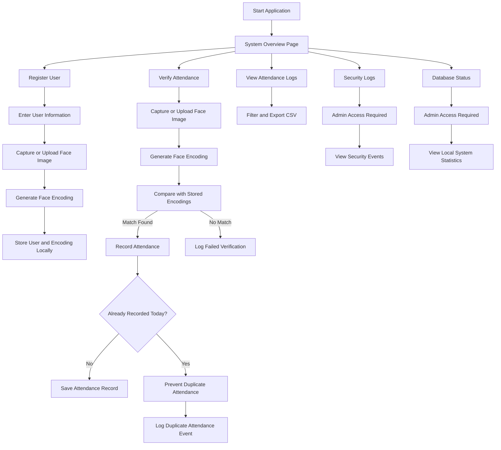
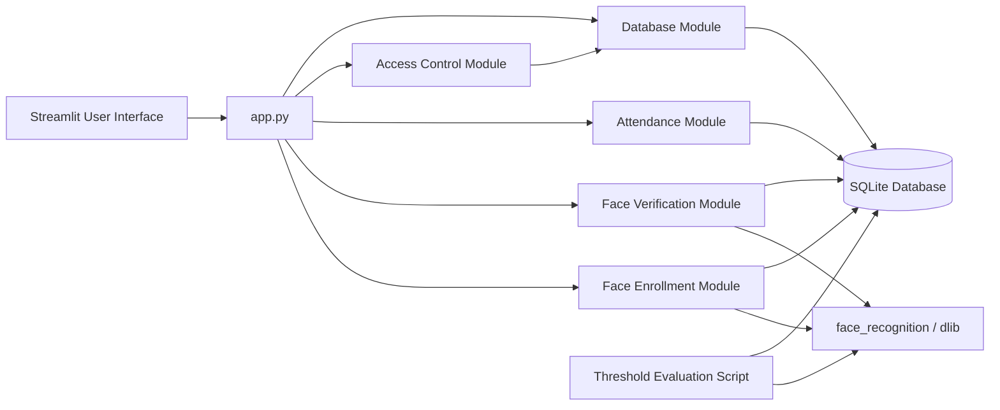

# Secure Attendance System Using Facial Recognition

## Overview

The **Secure Attendance System Using Facial Recognition** is a Python-based attendance management system developed as part of the CCRI Summer Research Internship.

The project uses face authentication to register users, verify identity, record attendance, prevent duplicate attendance, generate attendance logs, and monitor security-related events. The system is implemented as a local **Streamlit web application** with an SQLite database and privacy-focused handling of face-related data.

The final version of the project includes enrollment, verification, attendance recording, reporting, security logging, admin access control, threshold evaluation, final documentation, and a professional demo-ready user interface.

---

## Current Project Status

| Phase | Status | Main Work Completed |
|---|---|---|
| Phase 1 | Completed | Research, requirement analysis, environment setup, early database and vision tests |
| Phase 2 | Completed | Face enrollment, face verification, attendance recording, Streamlit dashboard |
| Phase 3 | Completed | Attendance reports, CSV export, security logs, duplicate prevention, admin access control |
| Phase 4 | Completed | Threshold testing, lighting and pose evaluation, limitations analysis, repository cleanup |
| Final Phase | Completed / Finalizing | UI enhancement, final demo preparation, final documentation, user manual, final submission materials |

---

## Problem Statement

Traditional attendance systems can be time-consuming, error-prone, and vulnerable to proxy attendance. Manual attendance sheets, ID cards, or simple login-based systems may not reliably confirm that the correct person is physically present.

This project addresses the problem by using **face authentication** to verify identity before recording attendance. The system aims to improve attendance security, automate the process, and provide useful attendance and security monitoring features.

---

## Project Objectives

The main objectives of this project are:

- Build a face-authenticated attendance system.
- Allow secure user enrollment using a face image.
- Verify users using facial recognition.
- Record attendance automatically after successful verification.
- Prevent duplicate attendance for the same user.
- Provide an attendance dashboard with filters and CSV export.
- Log security-related events such as failed verification and duplicate attempts.
- Protect sensitive monitoring pages using admin access control.
- Evaluate system behavior under different thresholds, lighting conditions, and face poses.
- Keep biometric-related data private and local.

---

## Key Features

| Feature | Description | Status |
|---|---|---|
| User Enrollment | Register users with student information and a face image | Completed |
| Face Encoding Storage | Store facial encodings locally in SQLite | Completed |
| Face Verification | Compare submitted face image with enrolled profiles | Completed |
| Attendance Recording | Automatically record attendance after successful verification | Completed |
| Duplicate Attendance Prevention | Prevent repeated attendance for the same user on the same day | Completed |
| Attendance Logs | View attendance records in a dashboard | Completed |
| CSV Export | Export filtered attendance logs as CSV | Completed |
| Security Logs | Track failed verification, duplicate attendance, and errors | Completed |
| Admin Access Control | Protect sensitive pages using admin password | Completed |
| Duplicate Enrollment Prevention | Prevent duplicate student IDs and duplicate face registration | Completed |
| Threshold Evaluation | Test different face recognition tolerance values | Completed |
| Lighting and Pose Testing | Evaluate behavior under different image conditions | Completed |
| System Overview Page | Professional final-demo landing page | Completed |
| Final Documentation | Final system status, demo checklist, deliverables checklist, user manual | Completed |

---

## System Workflow



---

## System Architecture



---

## Face Recognition Approach

This project uses the `face_recognition` Python library, which is built on top of `dlib`.

The system does **not** train a new deep learning model from scratch. Instead, it uses a pretrained face recognition model to generate face embeddings/encodings. During enrollment, the generated encoding is stored locally. During verification, the system compares a new face encoding with stored encodings using face distance.

### Recognition Logic

| Step | Description |
|---|---|
| Enrollment | A user provides a clear face image |
| Encoding | The system generates a numerical face encoding |
| Storage | The encoding is stored locally in SQLite |
| Verification | A new face image is encoded and compared with stored encodings |
| Matching | The system checks if the face distance is within the selected tolerance |
| Attendance | If matched, attendance is recorded automatically |

---

## Technology Stack

| Category | Technology |
|---|---|
| Programming Language | Python |
| Web Interface | Streamlit |
| Database | SQLite |
| Face Recognition | face_recognition |
| Face Model Backend | dlib |
| Data Handling | Pandas, NumPy |
| Image Handling | Pillow, OpenCV |
| Version Control | Git and GitHub |
| Environment | Conda / Python virtual environment |

---

## Repository Structure

```text
Secure-Attendance-System-Using-Facial-Recognition/
│
├── app.py
├── README.md
├── requirements.txt
├── environment.yml
├── .env.example
├── .gitignore
│
├── src/
│   ├── __init__.py
│   ├── database.py
│   ├── face_enrollment.py
│   ├── face_verification.py
│   ├── attendance.py
│   └── access_control.py
│
├── scripts/
│   └── evaluate_thresholds.py
│
├── docs/
│   ├── phase_1/
│   │   └── PHASE_1_DOCUMENTATION.md
│   │
│   ├── Phase_2/
│   │   └── PHASE_2_DOCUMENTATION.md
│   │
│   ├── phase_3_security_reporting/
│   │   ├── phase_3_summary.md
│   │   └── testing_matrix.md
│   │
│   ├── phase_4_evaluation/
│   │   ├── threshold_testing_plan.md
│   │   ├── lighting_pose_testing_matrix.md
│   │   ├── evaluation_results_summary.md
│   │   └── system_limitations_and_improvements.md
│   │
│   └── final_submission/
│       ├── deployment_demo_checklist.md
│       ├── final_deliverables_checklist.md
│       ├── final_system_status.md
│       └── user_manual.md
│
├── notebooks/
│   └── Phase1_Vision_and_DB_Tests.ipynb
│
└── data/
    └── .gitkeep
```

---

## Installation

### 1. Clone the Repository

```powershell
git clone https://github.com/Mohamad-101/Secure-Attendance-System-Using-Facial-Recognition.git
cd Secure-Attendance-System-Using-Facial-Recognition
```

### 2. Create and Activate Conda Environment

```powershell
conda create -n attendance python=3.10 -y
conda activate attendance
```

### 3. Install dlib

Installing `dlib` through Conda is recommended:

```powershell
conda install -c conda-forge dlib -y
```

### 4. Install Python Requirements

```powershell
python -m pip install -r requirements.txt
```

Main required packages include:

```text
streamlit
face-recognition
numpy==1.26.4
pandas
Pillow
opencv-python-headless
```

---

## Running the Application

Run the application using:

```powershell
python -m streamlit run app.py
```

Using `python -m streamlit run app.py` is recommended because some Windows systems may block direct execution of `streamlit.exe`.

---

## Application Pages

### 1. System Overview

The System Overview page provides a professional final-demo landing page.

It includes:

- Main workflow
- Current system metrics
- Final demo guide
- Privacy reminder
- Current limitations

---

### 2. Register User

This page allows user enrollment.

Inputs:

- Student ID
- Full name
- Optional email
- Role
- Face image using camera or image upload

The system prevents:

- Registering the same student ID twice
- Registering the same face under a different ID

---

### 3. Verify Attendance

This page verifies the user’s face and records attendance.

The system:

- Accepts a camera image or uploaded image
- Generates a face encoding
- Compares it with stored encodings
- Displays the best face distance
- Records attendance if the face is recognized
- Prevents duplicate attendance on the same day

---

### 4. View Attendance Logs

This page provides attendance reporting.

Features:

- Search by student ID or name
- Filter by date range
- Filter by attendance status
- View summary metrics
- Export filtered logs as CSV

---

### 5. Security Logs

This page tracks security-related events.

Examples of logged events:

- Failed verification
- Duplicate attendance attempt
- Enrollment error
- No face detected
- Multiple faces detected
- Admin access denied

This page requires admin access.

---

### 6. Database Status

This page shows local database statistics.

It displays:

- Registered users count
- Face profiles count
- Attendance logs count
- Security logs count

This page requires admin access.

---

## Admin Access

Sensitive pages are protected using an admin password.

Protected pages include:

- Security Logs
- Database Status

The default local admin password is:

```text
admin123
```

For safer use, set an environment variable before running the app:

```powershell
$env:ADMIN_PASSWORD="your_secure_password"
python -m streamlit run app.py
```

---

## Database Design

The system uses SQLite for local storage.

Main stored data includes:

| Data Type | Purpose |
|---|---|
| Users | Store student/user information |
| Face Profiles | Store local face encodings |
| Attendance Logs | Store attendance records |
| Security Logs | Store failed attempts, duplicate attempts, and system events |

The database is created locally and should not be uploaded to GitHub.

---

## Evaluation and Testing

The project includes evaluation documentation and a local threshold testing script.

### Threshold Evaluation Script

File:

```text
scripts/evaluate_thresholds.py
```

Example usage:

```powershell
python scripts\evaluate_thresholds.py "C:\path\to\test_image.jpg"
```

The script evaluates a test image using multiple tolerance values:

| Tolerance | Meaning |
|---:|---|
| 0.45 | Very strict |
| 0.50 | Strict |
| 0.55 | Balanced |
| 0.60 | Default |
| 0.65 | Flexible |

---

## Evaluation Results Summary

Example local testing results:

| Test Condition | Face Distance | Result | Observation |
|---|---:|---|---|
| Good lighting | 0.3430 | Accepted | Strong match |
| Low lighting | 0.4377 | Accepted | Distance increased but still accepted |
| Bright lighting | 0.3929 | Accepted | Accepted under bright lighting |
| Side pose | N/A | No face detected | Limitation for non-frontal faces |
| Same image reused | 0.0000 | Accepted | Expected because identical image was reused |

These results show that the system performs best with clear, front-facing images. Strong side pose or poor image conditions may affect face detection and verification.

---

## Security and Privacy

Because this project handles face-related biometric data, privacy was treated as a major concern.

### Privacy Rules Followed

- Face images are kept local.
- SQLite database files are kept local.
- Biometric encodings are not uploaded to GitHub.
- Test images are not included in the public repository.
- Only source code, documentation, and numerical evaluation results are pushed to GitHub.
- Testing with another person should only be done with consent.

### GitHub Privacy Check

Before final submission, run:

```powershell
git ls-files | Select-String -Pattern "\.jpg$|\.jpeg$|\.png$|\.db$|\.sqlite$|\.sqlite3$|face_data|test_faces|test_images|data/"
```

The only acceptable result should be:

```text
data/.gitkeep
```

---

## Final Demo Flow

Recommended final demonstration sequence:

| Step | Demo Action | Expected Result |
|---:|---|---|
| 1 | Open System Overview | Show project workflow and metrics |
| 2 | Register a test user | User is enrolled successfully |
| 3 | Verify attendance | Face is recognized and attendance is recorded |
| 4 | Verify same user again | Duplicate attendance is prevented |
| 5 | Open Attendance Logs | Attendance records and filters are shown |
| 6 | Export CSV | Filtered attendance records are downloaded |
| 7 | Open Security Logs | Admin password is required |
| 8 | Review Security Logs | Security events are displayed |
| 9 | Open Database Status | Local database metrics are displayed |
| 10 | Explain privacy handling | Confirm no biometric data is uploaded |

---

## Final Deliverables

| Deliverable | Status |
|---|---|
| Secure Attendance System | Completed |
| Face Authentication Workflow | Completed |
| Attendance Dashboard | Completed |
| Security Logs Dashboard | Completed |
| Source Code Repository | Completed |
| Technical Documentation | Completed |
| User Manual | Completed |
| Evaluation Documentation | Completed |
| Final Demo Checklist | Completed |
| Final Project Report | In progress / final submission stage |
| Presentation Slides | In progress / final submission stage |
| Completion Certificate Request | To be requested from internship coordinator |

---

## Limitations

The current system is functional, but it has some limitations:

- Works best with clear, front-facing images.
- Strong side pose may prevent face detection.
- Very poor lighting may reduce recognition accuracy.
- Advanced liveness detection is not implemented.
- Anti-spoofing protection is not implemented.
- Testing was performed using a limited local dataset.
- Deployment is local using Streamlit.

---

## Future Improvements

Possible future improvements include:

- Add liveness detection.
- Add anti-spoofing protection.
- Improve support for pose variation.
- Improve performance under poor lighting.
- Add role-based dashboards.
- Add cloud deployment.
- Add session-based attendance management.
- Add charts and advanced attendance analytics.
- Test with a larger and more diverse dataset.

---

## Troubleshooting

| Issue | Solution |
|---|---|
| `streamlit.exe` blocked on Windows | Use `python -m streamlit run app.py` |
| Wrong Python environment | Run `conda activate attendance` |
| dlib installation fails | Install using `conda install -c conda-forge dlib -y` |
| No enrolled users | Register a user first |
| No face detected | Use a clear, front-facing image |
| NumPy/image format issue | Use `numpy==1.26.4` |
| Security Logs not opening | Enter the admin password |

---

## Academic Context

This project was developed as part of the CCRI Summer Research Internship and is being used as a mandatory internship project for the student’s faculty requirements.

The project demonstrates practical work in:

- Computer vision
- Face recognition
- Secure attendance systems
- Streamlit application development
- SQLite database design
- Privacy-aware biometric system design
- Testing and evaluation

---

## Author

**Mohamad El Saleh**

Project: **Secure Attendance System Using Facial Recognition**

GitHub Repository:  
```text
https://github.com/Mohamad-101/Secure-Attendance-System-Using-Facial-Recognition
```

---

## Important Notice

This project is intended for academic and research internship purposes.

The system should be used responsibly and ethically. Face images and biometric-related data should only be collected with consent and should remain private and secure.