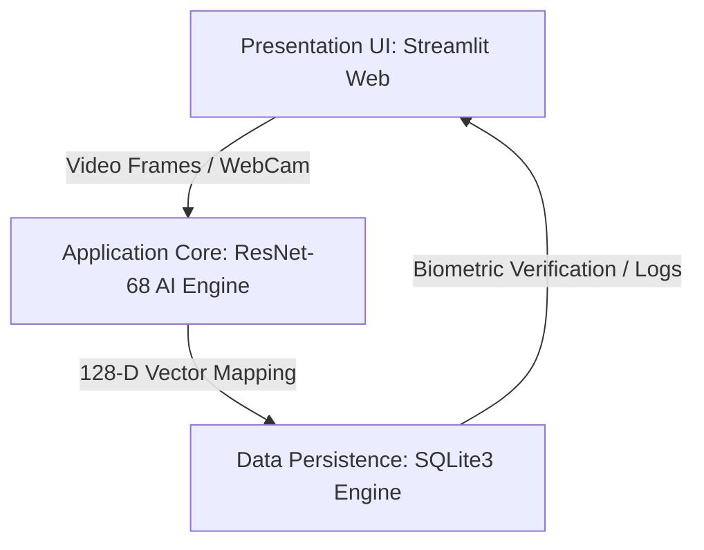
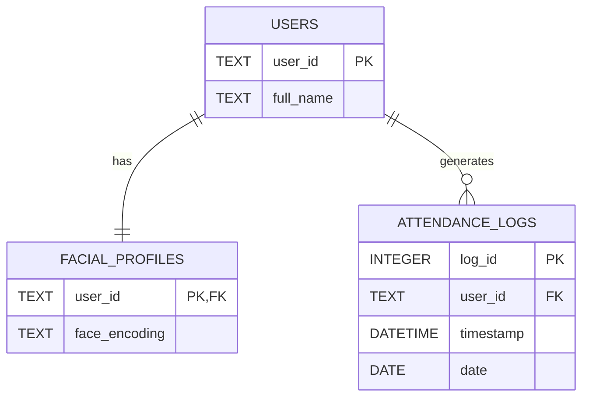

# Secure Attendance System with Face Authentication

## Project Documentation & Implementation Plan

**Host Institution:** International Center for AI and Cyber Security Research and Innovations (CCRI)

**Academic Affiliation:** Lebanese University Faculty of Engineering (ULFG)


## 1. Project Overview

### 1.1 Problem Statement

Traditional attendance tracking methods suffer from critical administrative and security vulnerabilities that compromise operational data integrity. The table below outlines these vectors and their respective impacts.

| Problem | Exploitation Vector / Vulnerability | Operational Impact | Severity |
| --- | --- | --- | --- |
| **Proxy Attendance** | Peer-to-peer credential/identity sharing | Grade/payroll inflation & compliance fraud | **High** |
| **Manual Recording** | Human data entry omissions & processing lag | Operational overhead & historical inaccuracy | **Medium** |
| **RFID Card Sharing** | Physical passing or cloning of contactless badges | Malicious identity bypass & security failure | **High** |
| **Password Systems** | Credential leakage, sniffing, or simple bypassing | Complete account takeover risks | **High** |
| **Paper-Based Records** | Physical loss, decay, or unauthorized rewriting | Unverifiable audit trails & data destruction | **High** |

### 1.2 Proposed Solution & System Architecture

To counter these vulnerabilities, we propose an automated biometric validation pipeline. The system decouples presentation, core processing logic, and data persistence to guarantee isolation and high-throughput execution.



### 1.3 Key Objectives

* **Real-Time Edge Execution:** Build a high-throughput localization pipeline capable of parsing biometric data frames rapidly without cloud dependencies.
* **Mathematical Enforcement:** Optimize a strict multi-dimensional boundary threshold ($d \le 0.60$) to minimize overall False Acceptance Rates (FAR).
* **Atomic Transaction Processing:** Design an optimized database backend that securely tracks state changes with immutable logs and relational cascades.
* **Universal Domain Scalability:** Generalize core access layers to support cross-industry deployment footprints seamlessly (academia, corporate enterprise, secure labs).

---

## 2. Literature Review & Background

### 2.1 Evolution of Face Recognition Technology

Modern biometric identification frameworks have transitioned completely from localized geometric measurements to deep learning vector transformations:

```
Timeline of Core Algorithmic Frameworks:
━━━━━━━━━━━━━━━━━━━━━━━━━━━━━━━━━━━━━━━━━━━━━━━━━━━━━━━━━━━━━━━━━━━━━━━━━━━━━━━━━━━━━
1960s: Eigenfaces          ──> Statistical PCA-driven linear sub-spaces.
1990s: LBP Histograms      ──> Local Binary Patterns micro-texture categorization.
2001s: Viola-Jones         ──> Haarcascade rapid rectangular integral image parsing.
2015s: FaceNet (Google)    ──> Deep CNNs mapping features to 128-D Euclidean spheres.
2019s: ArcFace             ──> Additive Angular Margin Loss for hyper-separation.
2024s: Vision Transformers ──> Attention-based patch encodings for tracking.
━━━━━━━━━━━━━━━━━━━━━━━━━━━━━━━━━━━━━━━━━━━━━━━━━━━━━━━━━━━━━━━━━━━━━━━━━━━━━━━━━━━━━

```

### 2.2 Face Detection Techniques Comparison

Selecting an optimal face localization algorithm requires evaluating trade-offs between frame-rate capacity and illumination resilience:

| Algorithm | Processing Speed | Accuracy Rate | Lighting Robustness | Optimal Target Use Case |
| --- | --- | --- | --- | --- |
| **Haar Cascade** | Ultra-Fast | Low-Medium | Low | Legacy hardware, static frames |
| **HOG + SVM** | Fast / Lightweight | High | Medium | CPU edge deployments, zero lag |
| **MTCNN** | Medium | High | High | Complex multi-face environments |
| **RetinaFace** | Slow (GPU Bound) | Ultra-High | Ultra-High | High-end production environments |
| **YOLOv8-Face** | Exceptionally Fast | High | High | Multi-object real-time streams |

### 2.3 Face Recognition Algorithmic Index

Analysis of facial profiling architectures shows that deep vector space mappings provide unparalleled production accuracy:

| Algorithm | Accuracy Index | Computational Footprint | Memory Allocation | Baseline Anti-Spoofing |
| --- | --- | --- | --- | --- |
| **Eigenfaces (PCA)** | 85% - 90% | Low | Low | Absolute None |
| **LBP Histograms** | 88% - 92% | Low | Low | Elementary Texture Check |
| **FisherFaces** | 90% - 93% | Medium | Medium | Absolute None |
| **FaceNet** | 99.63% | High | High | Coordinate Metric Bounds |
| **ArcFace** | 99.83% | High | High | Angular Margin Clustering |
| **dlib (ResNet-68)** | 99.38% | Medium | Medium | Metric Threshold Vector |

### 2.4 Presentation Attack Detection (Anti-Spoofing)

A secure biometric architecture must establish robust mechanisms to mitigate physical presentation attacks:

| Attack Vector Classification | Risk Profile | Strategy | System Countermeasure Mechanism |
| --- | --- | --- | --- |
| **Static Photo Attack** | High | Texture analysis | High-frequency surface texture & moiré pattern analysis |
| **Video Replay Attack** | High | Liveness tracking | Micro-movement tracking, blinking detection, and variance checking |
| **3D Mask Attack** | Critical | Depth sensing | Structured light projection or hardware-bound depth sensor checks |
| **Deepfake Attack** | High | Artifact filtering | Phase frequency spectrum artifact analysis & boundary blending checks |

---

## 3. System Requirements & Architecture

### 3.1 Functional Requirements (FR)

```
REGISTRATION AND CORE BIOMETRIC INGESTION LAYER
├── FR-101: System must capture multiple enrollment perspectives to initialize identities.
├── FR-102: System must convert raw facial assets into normalized float vectors.
└── FR-103: System must serialize multidimensional vector spaces into queryable database models.

REAL-TIME INFERENCE PIPELINE
├── FR-104: Pipeline must enforce an absolute Euclidean matching constraint of d <= 0.60.
├── FR-105: Frame ingestion must operate at low processing latency to prevent UI hitching.
└── FR-106: Authentication modules must reject identification attempts that exceed boundary conditions.

AUTOMATED LOGGING AND DATA EXPORT
├── FR-107: Logs must automatically register localized check-in states without manual user action.
└── FR-108: Management layers must support programmatic reporting conversions into clean CSV format.

```

### 3.2 Non-Functional Requirements (NFR)

* **Performance:** Maximum transaction processing time from initial frame parsing to database log commit must be $< 500\text{ms}$.
* **Data Security:** Biometric elements must be transformed into highly un-hashable coordinate array listings rather than storing raw video or graphic files.
* **Relational Safety:** The database layout must enforce strict structural parent-child configurations via active foreign keys.

---

## 4. Database Design

To optimize security and ensure data atomicity, the persistence layer utilizes a structured relational database layout configured to ensure data consistency.

### 4.1 Entity Relationship Diagram (ERD)

The diagram below details the relationship schema mapping. It showcases the central identity anchor pointing to the detached biometric profile and logging instances.



### 4.2 Relational Integrity & Serialization Policy

* **Users Master Schema:** Acts as the authoritative baseline identity ledger.
* **Facial_Profiles Table:** Keeps structural biometric elements completely isolated from general application tracking metrics. The raw 128-D floating-point arrays are securely flattened and stored as text-based JSON arrays.
* **Attendance_Logs Table:** Automatically records successful identification sessions. The table utilizes cascading foreign keys (`ON DELETE CASCADE`), ensuring that if an authoritative user profile is deleted, all secondary biometric logs and trace records are fully scrubbed from the system automatically.
