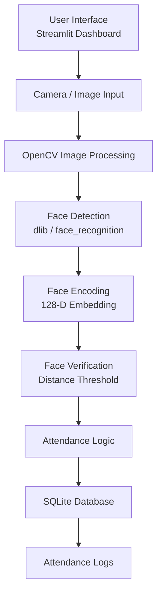
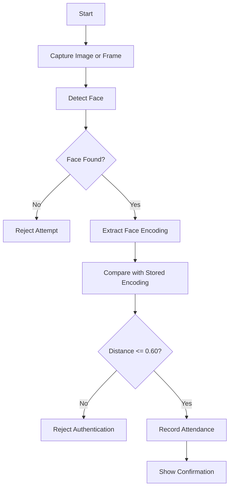
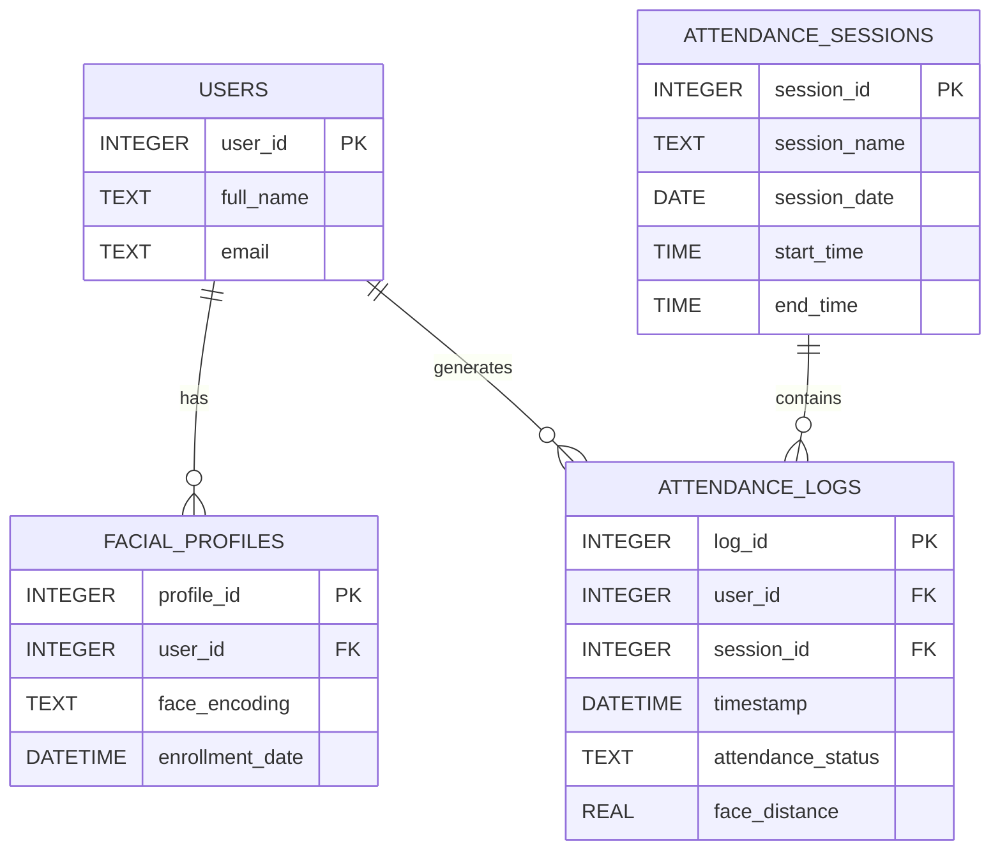

# Secure Attendance System with Face Authentication

## Phase 1 Documentation

**Host Institution:** International Center for AI and Cyber Security Research and Innovations (CCRI)

**Academic Affiliation:** Lebanese University – Faculty of Engineering

**Phase:** Phase 1 — Research, Requirements, Architecture, Environment Setup, and Database Design

**Timeline:** June 6 – June 20

---

## 1. Project Overview

### 1.1 Problem Statement

Attendance management is important in universities, companies, and organizations. Traditional attendance systems such as manual sheets, RFID cards, and password-based systems are easy to misuse because they do not always confirm the real identity of the person marking attendance.

The main problems are proxy attendance, human error, identity sharing, and weak record security.

| Problem           | Description                                    | Impact                   |
| ----------------- | ---------------------------------------------- | ------------------------ |
| Proxy Attendance  | One person marks attendance for another person | False attendance records |
| Manual Recording  | Attendance is written or entered manually      | Human error and delays   |
| RFID Card Sharing | Cards can be passed to another person          | Identity bypass          |
| Password Systems  | Passwords can be shared or stolen              | Unauthorized access      |
| Paper Records     | Records can be lost or modified                | Weak audit trail         |

### 1.2 Proposed Solution

The proposed solution is a secure attendance system that uses face authentication. The system detects a user’s face, converts it into a numerical face encoding, compares it with stored facial profiles, and records attendance only when the identity is verified.

For Phase 1, the focus is not to build the full final application yet. The goal is to complete the research, define the architecture, prepare the environment, and design the database and attendance framework.

---

## 2. Literature Review Summary

Face recognition systems have evolved from traditional image-processing methods to deep learning-based biometric systems. Older methods such as Eigenfaces and Local Binary Patterns were useful in controlled environments, but they were sensitive to lighting, pose, and image quality.

Modern systems use deep learning models to convert a face into a compact numerical representation called a face embedding. These embeddings can then be compared using distance-based methods.

| Method                  | Main Idea                                | Notes                                          |
| ----------------------- | ---------------------------------------- | ---------------------------------------------- |
| Eigenfaces              | Uses PCA to represent face images        | Simple but sensitive to lighting and pose      |
| LBPH                    | Uses local texture patterns              | Works better in controlled environments        |
| Haar Cascade            | Detects faces using handcrafted features | Fast but less accurate in difficult conditions |
| HOG + SVM               | Detects faces using gradient features    | Good CPU-based baseline                        |
| FaceNet / ArcFace       | Uses deep learning embeddings            | Strong modern face recognition methods         |
| dlib / face_recognition | Generates 128-dimensional face encodings | Practical for prototype development            |

For this project, the initial prototype uses the `face_recognition` library, which is built on dlib and generates 128-dimensional facial encodings. OpenCV is used mainly for image processing and camera input, while the face recognition model is responsible for comparing identities.

---

## 3. Techniques Studied

### 3.1 Face Detection

Face detection is the process of locating a face inside an image or video frame. It is the first step before face recognition can happen.

| Technique                      | Strength                  | Limitation                          |
| ------------------------------ | ------------------------- | ----------------------------------- |
| Haar Cascade                   | Very fast                 | Less accurate in difficult lighting |
| HOG + SVM                      | Lightweight and practical | Works best with clear frontal faces |
| MTCNN                          | More accurate             | Slower than basic methods           |
| RetinaFace / YOLO-based models | High accuracy             | Better suited for advanced phases   |

### 3.2 Face Recognition

Face recognition compares a detected face with stored user profiles. In this project, the planned approach is to use facial embeddings.

A facial embedding is a numerical vector that represents the unique features of a face. If two face embeddings are close to each other, they are likely to belong to the same person.

The prototype uses a distance threshold:

```text
If face_distance <= 0.60:
    Accept authentication
Else:
    Reject authentication
```

The value `0.60` is used as an initial threshold and should be tested later under different lighting, angles, and image qualities.

### 3.3 Anti-Spoofing Considerations

A secure face authentication system should consider spoofing attacks such as printed photos, replayed videos, or fake faces. During Phase 1, anti-spoofing is studied as a security concern, but full liveness detection is planned for later phases.

| Attack Type     | Example                        | Future Countermeasure              |
| --------------- | ------------------------------ | ---------------------------------- |
| Photo Attack    | Printed photo or phone image   | Blink detection or texture checks  |
| Video Replay    | Recorded video shown to camera | Motion and liveness checks         |
| Mask Attack     | Physical fake face             | Depth or multi-angle verification  |
| Deepfake Attack | Synthetic face image/video     | Artifact and consistency detection |

---

## 4. System Requirements

### 4.1 Functional Requirements

| ID    | Requirement                                          | Phase 1 Status          |
| ----- | ---------------------------------------------------- | ----------------------- |
| FR-01 | Detect a face from an image or webcam frame          | Prototype tested        |
| FR-02 | Convert a detected face into a facial encoding       | Prototype tested        |
| FR-03 | Compare face encodings using distance measurement    | Prototype tested        |
| FR-04 | Accept or reject authentication based on a threshold | Prototype tested        |
| FR-05 | Store users and facial profiles in a database        | Designed                |
| FR-06 | Record attendance after successful verification      | Designed for next phase |
| FR-07 | Provide a dashboard for monitoring attendance        | Planned for next phase  |
| FR-08 | Generate attendance reports                          | Planned for later phase |

### 4.2 Non-Functional Requirements

| Category        | Requirement                                                       |
| --------------- | ----------------------------------------------------------------- |
| Performance     | The system should process face authentication with low delay      |
| Security        | Biometric data should be protected from unauthorized access       |
| Privacy         | Raw face images should not be stored unless necessary             |
| Reliability     | The database should use primary keys and foreign keys             |
| Maintainability | The code should be organized into clear modules                   |
| Reproducibility | The repository should include setup instructions and dependencies |

---

## 5. Development Environment

The initial development environment is based on Python and common computer vision tools.

| Tool                    | Purpose                                    |
| ----------------------- | ------------------------------------------ |
| Python                  | Main programming language                  |
| OpenCV                  | Image processing and camera frame handling |
| dlib / face_recognition | Face detection, encoding, and comparison   |
| SQLite                  | Local database for the prototype           |
| NumPy                   | Numerical processing                       |
| Pandas                  | Future report handling                     |
| Jupyter / Google Colab  | Research and testing environment           |
| Streamlit               | Planned dashboard interface                |

Recommended `requirements.txt`:

```text
opencv-python
face-recognition
dlib
numpy
pandas
matplotlib
jupyter
streamlit
```

Basic installation command:

```bash
pip install -r requirements.txt
```

Note: `dlib` and `face_recognition` may require additional setup depending on the operating system.

---

## 6. Proposed System Architecture

The system is divided into simple layers so that each part has a clear responsibility.



### 6.1 Authentication Workflow



---

## 7. Database Design

The database is designed to store users, facial profiles, attendance sessions, and attendance logs. The goal is to keep the design simple but realistic for an attendance system.

### 7.1 Entity Relationship Diagram



### 7.2 Table Descriptions

| Table               | Purpose                                       |
| ------------------- | --------------------------------------------- |
| Users               | Stores basic user information                 |
| Facial_Profiles     | Stores the user’s facial encoding             |
| Attendance_Sessions | Stores class, lab, meeting, or event sessions |
| Attendance_Logs     | Stores attendance records after verification  |

### 7.3 Proposed SQL Schema

```sql
PRAGMA foreign_keys = ON;

CREATE TABLE IF NOT EXISTS Users (
    user_id INTEGER PRIMARY KEY AUTOINCREMENT,
    full_name TEXT NOT NULL,
    email TEXT UNIQUE
);

CREATE TABLE IF NOT EXISTS Facial_Profiles (
    profile_id INTEGER PRIMARY KEY AUTOINCREMENT,
    user_id INTEGER NOT NULL,
    face_encoding TEXT NOT NULL,
    enrollment_date DATETIME DEFAULT CURRENT_TIMESTAMP,
    FOREIGN KEY (user_id) REFERENCES Users(user_id) ON DELETE CASCADE
);

CREATE TABLE IF NOT EXISTS Attendance_Sessions (
    session_id INTEGER PRIMARY KEY AUTOINCREMENT,
    session_name TEXT NOT NULL,
    session_date DATE NOT NULL,
    start_time TIME,
    end_time TIME
);

CREATE TABLE IF NOT EXISTS Attendance_Logs (
    log_id INTEGER PRIMARY KEY AUTOINCREMENT,
    user_id INTEGER NOT NULL,
    session_id INTEGER,
    timestamp DATETIME DEFAULT CURRENT_TIMESTAMP,
    attendance_status TEXT DEFAULT 'present',
    face_distance REAL,
    FOREIGN KEY (user_id) REFERENCES Users(user_id) ON DELETE CASCADE,
    FOREIGN KEY (session_id) REFERENCES Attendance_Sessions(session_id) ON DELETE SET NULL
);
```

### 7.4 Facial Encoding Storage

The face recognition model produces a 128-dimensional numerical encoding. Since SQLite does not store NumPy arrays directly, the encoding can be converted to JSON text before saving.

```python
import json

serialized_encoding = json.dumps(face_encoding.tolist())
```

When reading it back:

```python
import json
import numpy as np

encoding_array = np.array(json.loads(serialized_encoding))
```

---

## 8. Attendance Management Framework

The attendance process should only create a log after the user is successfully verified.

| Condition                                    | Action                           |
| -------------------------------------------- | -------------------------------- |
| No face is detected                          | Reject the attempt               |
| More than one face is detected               | Reject and request one face only |
| Face distance is above the threshold         | Reject authentication            |
| Face distance is within the threshold        | Record attendance                |
| User already checked in for the same session | Prevent duplicate attendance     |
| Uncertain result                             | Mark for manual review           |

Suggested attendance statuses:

| Status        | Meaning                                  |
| ------------- | ---------------------------------------- |
| present       | User was verified successfully           |
| late          | User was verified after the allowed time |
| rejected      | Face verification failed                 |
| manual_review | Result needs administrator review        |
| absent        | User did not attend                      |

---

## 9. Privacy and Ethical Considerations

Facial data is sensitive biometric information, so the system must be designed carefully.

| Principle         | Explanation                                                           |
| ----------------- | --------------------------------------------------------------------- |
| Consent           | Users should give permission before their facial images are collected |
| Data Minimization | The system should avoid storing raw face images                       |
| Access Control    | Only authorized users should access biometric and attendance records  |
| Secure Storage    | Future versions should protect stored encodings and database files    |
| Transparency      | Users should know why their face data is collected and how it is used |

Current limitations:

* Liveness detection is not implemented yet.
* Database encryption is not implemented yet.
* The prototype uses a small testing sample.
* The threshold value still needs evaluation with more users and conditions.

---

## 10. Phase 1 Prototype Scope

The current Phase 1 work focuses on research and prototype validation.

| Feature                              | Status                   |
| ------------------------------------ | ------------------------ |
| Literature review                    | Completed                |
| Face detection and recognition study | Completed                |
| System architecture                  | Completed                |
| Environment setup                    | Completed                |
| Database design                      | Completed                |
| Face encoding prototype              | Completed or in progress |
| Attendance log insertion             | To be added next         |
| Dashboard                            | Planned for Phase 2      |
| Full reporting module                | Planned for later phase  |
| Deployment                           | Planned for final phase  |

---

## 11. Next Steps

The next phase should focus on turning the prototype into a working application.

Planned tasks:

* Build a user enrollment module.
* Move notebook code into Python files.
* Add attendance recording after successful authentication.
* Prevent duplicate check-ins for the same session.
* Start the Streamlit dashboard.
* Add basic CSV export for attendance logs.

---

## 12. References

[1] M. Turk and A. Pentland, [“Eigenfaces for Recognition,”](https://direct.mit.edu/jocn/article/3/1/71/3025/Eigenfaces-for-Recognition) *Journal of Cognitive Neuroscience*, 1991.

[2] P. Viola and M. Jones, [“Rapid Object Detection using a Boosted Cascade of Simple Features,”](https://www.cs.cmu.edu/~efros/courses/LBMV07/Papers/viola-cvpr-01.pdf) *CVPR*, 2001.

[3] N. Dalal and B. Triggs, [“Histograms of Oriented Gradients for Human Detection,”](https://lear.inrialpes.fr/people/triggs/pubs/Dalal-cvpr05.pdf) *CVPR*, 2005.

[4] F. Schroff, D. Kalenichenko, and J. Philbin, [“FaceNet: A Unified Embedding for Face Recognition and Clustering,”](https://arxiv.org/abs/1503.03832) *CVPR*, 2015.

[5] D. E. King, [“dlib-ml: A Machine Learning Toolkit,”](https://jmlr.org/papers/v10/king09a.html) *Journal of Machine Learning Research*, 2009.

[6] J. Deng, J. Guo, N. Xue, and S. Zafeiriou, [“ArcFace: Additive Angular Margin Loss for Deep Face Recognition,”](https://arxiv.org/abs/1801.07698) *CVPR*, 2019.

[7] ISO/IEC 30107, [“Information Technology — Biometric Presentation Attack Detection,”](https://www.iso.org/standard/53227.html) International Organization for Standardization.

