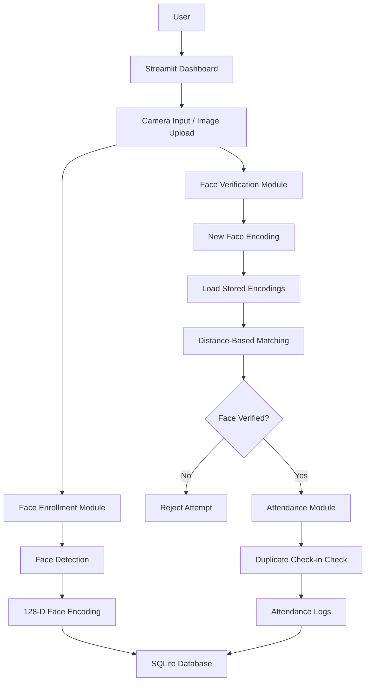
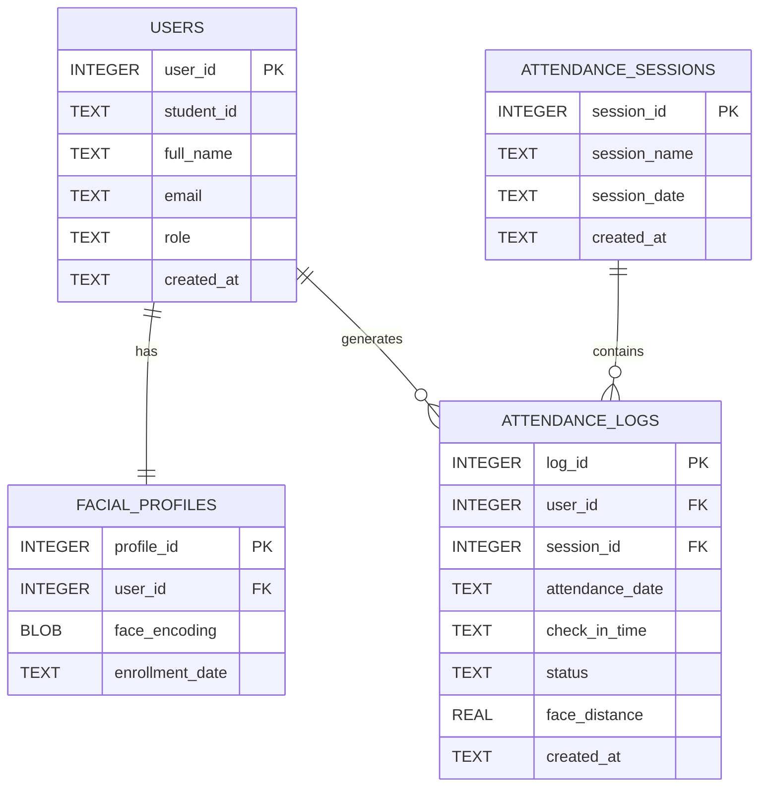
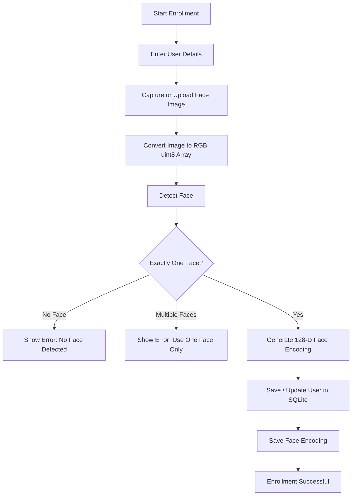
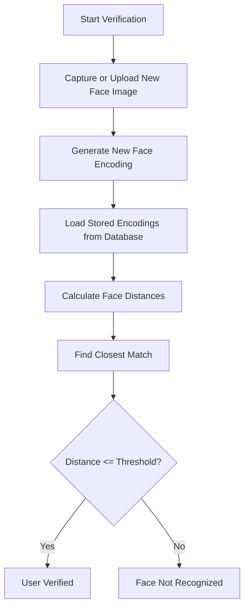
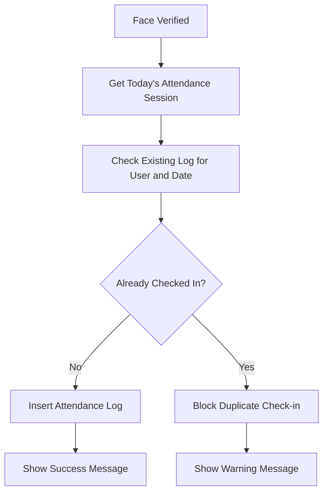
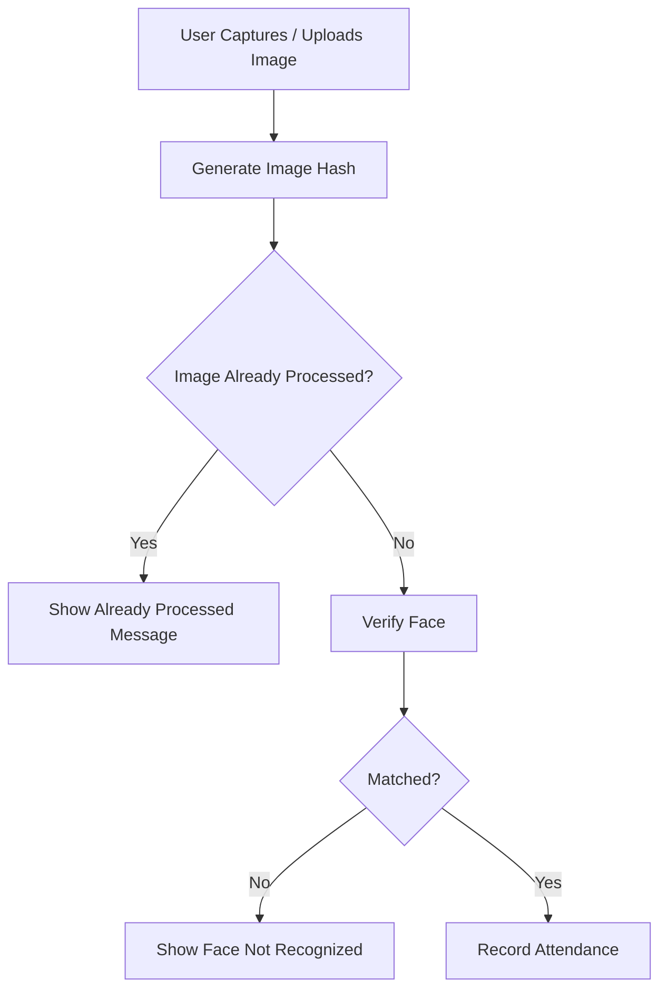

# Secure Attendance System with Face Authentication

## Phase 2 Documentation: Enrollment, Verification, and Attendance Dashboard

**Developer:** Mohamad El Saleh

**Host Institution:** International Center for AI and Cyber Security Research and Innovations (CCRI)

**Academic Affiliation:** Lebanese University – Faculty of Engineering

**Phase:** Phase 2 — Enrollment, Verification, Attendance Logging, and Streamlit Dashboard

**Timeline:** Week 3 – Week 4

---

## 1. Phase 2 Overview

Phase 2 focused on transforming the initial research and prototype work from Phase 1 into a functional attendance system MVP. In Phase 1, the project studied biometric authentication, facial recognition, face encodings, distance-based verification, database design, and the planned system architecture. Phase 2 implemented these ideas in a working local application.

The system now allows a user to register with personal information and a face image, generate and store a facial encoding, verify a user using a new face image, record attendance after successful verification, prevent duplicate check-ins, and view attendance logs through a Streamlit dashboard.

The main goal of Phase 2 was to build the first usable version of the Secure Attendance System before moving into more advanced security improvements such as anti-spoofing and reliability testing in Phase 3.

---

## 2. Phase 2 Objectives

The main objectives of Phase 2 were:

* Convert prototype logic into reusable Python modules.
* Create a local development environment suitable for facial recognition libraries.
* Implement a SQLite database layer for storing users, facial profiles, attendance sessions, and attendance logs.
* Build a face enrollment module for registering users.
* Generate and store 128-dimensional facial encodings.
* Implement face verification using distance-based comparison.
* Record attendance after successful facial verification.
* Prevent duplicate check-ins for the same user on the same day.
* Build a Streamlit dashboard for registration, verification, attendance logs, and database status.
* Add CSV export for attendance logs.
* Protect biometric data by excluding local databases and test images from GitHub.

---

## 3. Implemented Phase 2 Features

| Feature                 | Description                                                    | Status    |
| ----------------------- | -------------------------------------------------------------- | --------- |
| Local development setup | Configured Python environment and installed required libraries | Completed |
| SQLite database layer   | Created database tables and helper functions                   | Completed |
| User registration       | Allows entering student ID, name, email, and role              | Completed |
| Face enrollment         | Detects one face and stores its encoding                       | Completed |
| Face verification       | Compares a new face image with stored encodings                | Completed |
| Distance threshold      | Uses face distance to accept or reject identity                | Completed |
| Attendance recording    | Records attendance after successful verification               | Completed |
| Duplicate prevention    | Blocks repeated attendance for the same day                    | Completed |
| Streamlit dashboard     | Provides user interface for system interaction                 | Completed |
| Attendance logs page    | Displays attendance records in a table                         | Completed |
| CSV export              | Allows downloading attendance logs as a CSV file               | Completed |
| Database reset testing  | Tested clearing local database for a fresh start               | Completed |

---

## 4. Updated Project Structure

The project was reorganized into modular files to separate database operations, face enrollment, face verification, attendance logic, and the user interface.

```text
Secure-Attendance-System-Using-Facial-Recognition/
│
├── app.py
├── requirements.txt
├── .gitignore
│
├── src/
│   ├── __init__.py
│   ├── database.py
│   ├── face_enrollment.py
│   ├── face_verification.py
│   └── attendance.py
│
├── docs/
│   ├── PHASE_1_DOCUMENTATION.md
│   └── PHASE_2_DOCUMENTATION.md
│
├── research_sandbox/
│   └── Phase1_Vision_and_DB_Tests.ipynb
│
└── data/
    └── attendance.db  (local only, ignored by Git)
```

### File Responsibilities

| File                       | Responsibility                                                                           |
| -------------------------- | ---------------------------------------------------------------------------------------- |
| `app.py`                   | Main Streamlit dashboard and user interface                                              |
| `src/database.py`          | SQLite database creation, queries, and attendance log handling                           |
| `src/face_enrollment.py`   | Image conversion, face detection, face encoding, and user enrollment                     |
| `src/face_verification.py` | Face comparison and identity verification                                                |
| `src/attendance.py`        | Attendance recording and duplicate check-in handling                                     |
| `.gitignore`               | Prevents local databases, images, environments, and sensitive files from being committed |

---

## 5. Development Environment

Phase 2 was developed locally after encountering limitations with cloud-based development and facial recognition package installation. A Conda environment was used to reduce compatibility issues with `dlib` and `face_recognition`.

### Main Tools and Libraries

| Tool / Library          | Purpose                                           |
| ----------------------- | ------------------------------------------------- |
| Python                  | Main programming language                         |
| Conda                   | Environment management                            |
| Streamlit               | Web dashboard interface                           |
| SQLite                  | Local database storage                            |
| dlib                    | Face recognition backend                          |
| face_recognition        | Face detection, encoding, and comparison          |
| face_recognition_models | Pretrained facial recognition model files         |
| OpenCV headless         | Image processing support                          |
| NumPy                   | Numerical processing and facial encoding handling |
| Pandas                  | Attendance log display and CSV export             |
| Pillow                  | Image loading and RGB conversion                  |

---

## 6. System Architecture

The Phase 2 system follows a modular architecture. The user interacts with the Streamlit dashboard, while the backend modules handle face processing, verification, database storage, and attendance recording.



---

## 7. Database Design

The database is implemented using SQLite. It stores user data, facial encodings, attendance sessions, and attendance logs.

### 7.1 Database Tables

| Table                 | Purpose                                                             |
| --------------------- | ------------------------------------------------------------------- |
| `users`               | Stores student ID, full name, email, role, and creation time        |
| `facial_profiles`     | Stores each user’s facial encoding                                  |
| `attendance_sessions` | Stores daily attendance session information                         |
| `attendance_logs`     | Stores attendance records, check-in time, status, and face distance |

### 7.2 Entity Relationship Diagram



### 7.3 Database Notes

* Each user has a unique student ID.
* Each user has one facial profile in the current implementation.
* Facial encodings are stored as binary data using NumPy serialization.
* Attendance records are linked to users and sessions.
* A unique attendance rule prevents the same user from checking in more than once per day.
* Local database files are ignored by Git to protect biometric data.

---

## 8. Face Enrollment Workflow

The face enrollment module registers a user and stores their face encoding in the database.

### Enrollment Steps

1. The user enters student ID, full name, optional email, and role.
2. The user captures or uploads a face image.
3. The image is converted into a valid RGB `uint8` NumPy array.
4. The system checks that exactly one face exists in the image.
5. A 128-dimensional facial encoding is generated.
6. User information is inserted or updated in the `users` table.
7. The face encoding is saved in the `facial_profiles` table.



### Enrollment Validation

| Condition               | System Response                        |
| ----------------------- | -------------------------------------- |
| Missing student ID      | Show error message                     |
| Missing full name       | Show error message                     |
| No image provided       | Show error message                     |
| No face detected        | Reject image and request clearer image |
| Multiple faces detected | Reject image and request one face only |
| Valid face image        | Generate encoding and save profile     |

---

## 9. Face Verification Workflow

The face verification module compares a new face image with stored facial encodings.

### Verification Steps

1. The user captures or uploads a new face image.
2. The image is converted into RGB `uint8` format.
3. The system detects one face and generates a new encoding.
4. Stored encodings are loaded from the SQLite database.
5. The system calculates the distance between the new encoding and each stored encoding.
6. The closest match is selected.
7. If the best distance is below or equal to the tolerance threshold, the user is verified.
8. If the distance is above the threshold, the face is rejected.



### Face Distance Logic

The system uses distance-based matching. A smaller distance means the new face is more similar to a stored face profile.

```text
If best_face_distance <= tolerance:
    Accept identity
Else:
    Reject identity
```

The current default tolerance value is:

```text
0.60
```

This value is suitable for the MVP but should be evaluated further with different users, lighting conditions, and camera angles.

---

## 10. Attendance Recording Workflow

Attendance is recorded only after successful face verification.

### Attendance Steps

1. The user is verified successfully.
2. The system gets or creates the current daily attendance session.
3. The system checks whether the user already has an attendance record for the same date.
4. If no previous record exists, a new attendance log is inserted.
5. If a record already exists, the system blocks duplicate check-in and shows a warning.



### Attendance Log Data

| Field           | Description                            |
| --------------- | -------------------------------------- |
| Student ID      | Identifies the student                 |
| Full Name       | Name of the verified user              |
| Role            | Student, teacher, or admin             |
| Session Name    | Attendance session name                |
| Attendance Date | Date of check-in                       |
| Check-in Time   | Time of successful attendance          |
| Status          | Attendance status, currently `present` |
| Face Distance   | Verification distance value            |

---

## 11. Streamlit Dashboard

The Phase 2 MVP includes a Streamlit dashboard with four main sections.

### 11.1 Register User

This page is used to enroll a new user.

Main functions:

* Enter student ID, full name, email, and role.
* Capture or upload a face image.
* Detect and encode the face.
* Save user information and face encoding to SQLite.

### 11.2 Verify Attendance

This page is used to verify a face and record attendance.

Main functions:

* Capture or upload a face image.
* Automatically process the image after capture/upload.
* Compare the new face encoding with stored encodings.
* Display matched user details and face distance.
* Record attendance if verification succeeds.
* Block duplicate attendance for the same day.

### 11.3 View Attendance Logs

This page displays saved attendance records.

Main functions:

* Display attendance logs in a table.
* Show student ID, name, role, date, time, status, and face distance.
* Export attendance logs as a CSV file.

### 11.4 Database Status

This page displays basic database statistics.

Main functions:

* Show number of registered users.
* Show number of stored facial profiles.
* Show number of attendance logs.

---

## 12. Automatic Verification Improvement

During Phase 2, the verification process was improved so that the user does not need to press a second button after taking or uploading a face image. Once an image is available, the system automatically verifies the face and records attendance if the match is successful.

To prevent the same image from being processed repeatedly during Streamlit reruns, the image bytes are hashed. The system stores the last processed image hash and avoids reprocessing the same image again.



---

## 13. Testing Performed

| Test Case                            | Expected Result                     | Status                        |
| ------------------------------------ | ----------------------------------- | ----------------------------- |
| Register a new user                  | User and face profile are saved     | Passed                        |
| Upload/capture valid face image      | Face is detected and encoded        | Passed                        |
| Verify enrolled user                 | User is matched successfully        | Passed                        |
| Show face distance                   | Distance value is displayed         | Passed                        |
| Record attendance after verification | Attendance log is created           | Passed                        |
| Attempt duplicate check-in           | Duplicate attendance is blocked     | Passed                        |
| View attendance logs                 | Logs are displayed in dashboard     | Passed                        |
| Export attendance logs               | CSV file can be downloaded          | Passed                        |
| Clear local database                 | System restarts with fresh database | Passed                        |
| No face in image                     | System should reject image          | Tested / needs more samples   |
| Multiple faces in image              | System should reject image          | Tested / needs more samples   |
| Unknown face                         | System should reject identity       | Needs more multi-user testing |

---

## 14. Privacy and Data Handling

Facial data is sensitive biometric information, so the system follows basic privacy precautions during development.

Current privacy practices:

* Raw face images are not intentionally stored by the application.
* Local SQLite database files are excluded from GitHub.
* Test images and biometric data folders are ignored by Git.
* Screenshots used in reports should be cropped or blurred to hide faces.
* Facial encodings are treated as sensitive data.
* The project uses local storage only during the MVP stage.

Recommended future privacy improvements:

* Add database encryption.
* Add user consent notice before enrollment.
* Add access control for dashboard pages.
* Add admin authentication.
* Avoid exposing logs or encodings in public repositories.
* Use privacy-safe demo screenshots in documentation.

---

## 15. Current Limitations

Although the Phase 2 MVP is functional, it still has limitations.

| Limitation                       | Explanation                                                                |
| -------------------------------- | -------------------------------------------------------------------------- |
| No full anti-spoofing yet        | The system may still accept a clear photo unless liveness checks are added |
| Limited user testing             | The system has not yet been tested on a large group of users               |
| Local database only              | SQLite is suitable for development but not final cloud deployment          |
| No login system                  | Dashboard pages are not protected by admin authentication yet              |
| No database encryption           | Stored face encodings are not encrypted in the current MVP                 |
| Image-based verification         | The system uses captured/uploaded images, not continuous live video        |
| Threshold still needs evaluation | The default tolerance value should be tested under different conditions    |

---

## 16. Phase 2 Outcome

Phase 2 successfully produced the first working MVP of the Secure Attendance System. The project moved from research and prototype validation into an operational local application.

The completed MVP supports:

```text
User registration
→ face enrollment
→ face encoding storage
→ face verification
→ automatic attendance recording
→ duplicate check-in prevention
→ attendance log viewing
→ CSV export
```

This provides a strong foundation for Phase 3, where the focus should shift from basic functionality to security, reliability, anti-spoofing, evaluation, and user experience improvements.

---

## 17. Phase 3 Next Steps

The next phase should focus on improving security and reliability.

Planned Phase 3 tasks:

* Add basic anti-spoofing or liveness checks.
* Add image quality checks such as blur and brightness validation.
* Test the system with multiple users.
* Evaluate different face distance thresholds.
* Log failed or suspicious verification attempts.
* Improve duplicate check-in reporting.
* Improve Streamlit interface design.
* Add authentication for admin/dashboard access.
* Update README and documentation to reflect completed Phase 2.
* Consider cloud deployment or migration to a cloud database in later phases.

---
