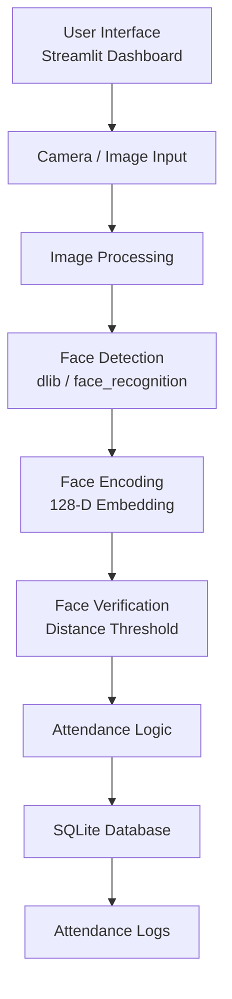
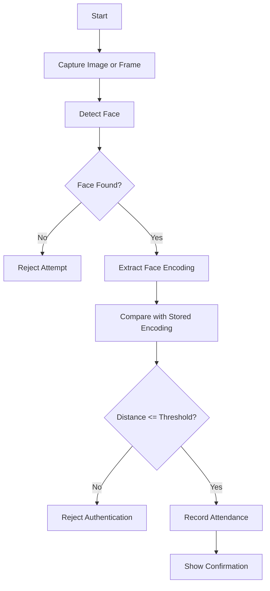
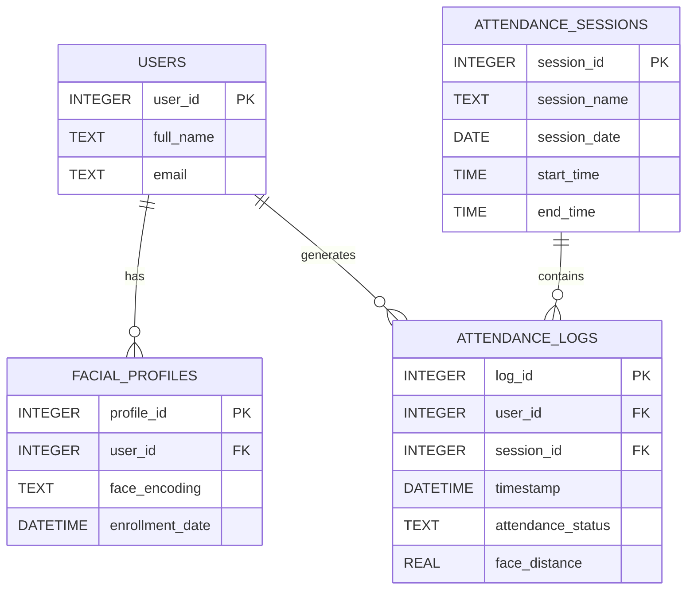

# Secure Attendance System with Face Authentication

## Phase 1 Documentation

**Developer:** Mohamad El Saleh  
**Host Institution:** International Center for AI and Cyber Security Research and Innovations (CCRI)  
**Academic Affiliation:** Lebanese University – Faculty of Engineering  
**Phase:** Phase 1 — Research, Requirements, Architecture, Environment Setup, and Database Planning  
**Timeline:** June 6 – June 20  

---

## 1. Phase 1 Overview

Phase 1 focused on the research, planning, and technical preparation needed before building the full Secure Attendance System. The goal of this phase was not to complete the final application, but to study suitable face recognition methods, define system requirements, prepare the development environment, design the initial database structure, and validate the basic concept of face-based authentication.

The project aims to develop a secure attendance system that uses face authentication to verify a user’s identity before recording attendance. Traditional attendance systems such as manual sheets, RFID cards, and password-based methods may suffer from proxy attendance, human error, identity sharing, and weak auditability. A face-authenticated system can reduce these issues by linking attendance records more directly to the verified identity of the user.

During Phase 1, the main focus was to answer the following technical questions:

- Which face recognition approach is suitable for a local prototype?
- How can facial features be represented numerically?
- How can face encodings be compared?
- What database structure is needed to store users, facial profiles, and attendance records?
- What security and privacy concerns should be considered when handling face-related biometric data?
- What system architecture should guide the next development phases?

---

## 2. Problem Statement

Attendance management is important in universities, companies, training programs, and organizations. However, traditional attendance systems can be vulnerable to several problems.

| Problem | Description | Impact |
|---|---|---|
| Proxy Attendance | One person marks attendance for another person | False attendance records |
| Manual Recording | Attendance is written or entered manually | Human error and delays |
| RFID Card Sharing | Cards can be passed to another person | Identity bypass |
| Password Systems | Passwords can be shared or stolen | Unauthorized access |
| Paper Records | Records can be lost, modified, or difficult to audit | Weak record reliability |

The main issue is that many attendance systems record that attendance was marked, but they do not strongly verify that the correct person was physically present. This creates a need for an attendance system that combines identity verification, automated attendance recording, and secure record management.

---

## 3. Proposed Solution

The proposed solution is a Secure Attendance System that uses face authentication. The system is intended to detect a user’s face, convert it into a numerical facial encoding, compare it with stored face profiles, and record attendance only when the identity is successfully verified.

In Phase 1, the solution was studied and planned at the design and prototype level. The focus was on preparing the foundation for later implementation phases, including:

- Researching face recognition techniques.
- Studying facial encodings and distance-based matching.
- Preparing the development environment.
- Designing the initial system architecture.
- Designing the planned database structure.
- Identifying privacy and security requirements.
- Defining the next steps for implementation.

---

## 4. Literature Review Summary

Face recognition systems have evolved from traditional image-processing methods to modern deep learning-based biometric systems. Older techniques such as Eigenfaces and Local Binary Patterns were useful in controlled environments, but they were often sensitive to lighting, pose, and image quality.

Modern face recognition systems usually convert a face image into a compact numerical representation called a facial embedding or face encoding. These encodings can then be compared using distance-based methods to determine whether two face images likely belong to the same person.

| Method | Main Idea | Notes |
|---|---|---|
| Eigenfaces | Uses PCA to represent face images | Simple but sensitive to lighting and pose |
| LBPH | Uses local texture patterns | Works better in controlled environments |
| Haar Cascade | Detects faces using handcrafted features | Fast but less accurate in difficult conditions |
| HOG + SVM | Detects faces using gradient features | Good CPU-based baseline |
| FaceNet / ArcFace | Uses deep learning embeddings | Strong modern face recognition approaches |
| dlib / face_recognition | Generates 128-dimensional face encodings | Practical for prototype development |

For this project, the planned prototype approach uses the `face_recognition` library, which is built on top of `dlib` and generates 128-dimensional facial encodings. This approach was selected because it is practical for local development and supports face detection, encoding generation, and distance-based comparison.

---

## 5. Techniques Studied

### 5.1 Face Detection

Face detection is the process of locating a face inside an image or video frame. It is the first step before face recognition can occur.

| Technique | Strength | Limitation |
|---|---|---|
| Haar Cascade | Very fast | Less accurate in difficult lighting |
| HOG + SVM | Lightweight and practical | Works best with clear frontal faces |
| MTCNN | More accurate | Slower than basic methods |
| RetinaFace / YOLO-based models | High accuracy | More suitable for advanced versions |

### 5.2 Face Recognition

Face recognition compares a detected face with stored user profiles. In the planned approach, each face is represented by a numerical encoding. If two encodings are close to each other, they are likely to belong to the same person.

The initial matching idea is based on a distance threshold:

```text
If face_distance <= threshold:
    Accept authentication
Else:
    Reject authentication
```

The value `0.60` was considered as an initial tolerance value for prototype testing. Later phases should evaluate this threshold under different conditions such as lighting, pose, image quality, and multiple users.

### 5.3 Anti-Spoofing Considerations

A secure face authentication system should consider spoofing attacks, such as printed photos, replayed videos, or artificial faces. During Phase 1, anti-spoofing was studied as a future security concern, but full liveness detection was not implemented in this phase.

| Attack Type | Example | Future Countermeasure |
|---|---|---|
| Photo Attack | Printed photo or phone image | Blink detection, texture checks, or liveness detection |
| Video Replay | Recorded video shown to camera | Motion and liveness checks |
| Mask Attack | Physical fake face | Depth or multi-angle verification |
| Deepfake Attack | Synthetic face image or video | Artifact and consistency detection |

---

## 6. System Requirements

### 6.1 Functional Requirements

| ID | Requirement | Phase 1 Status |
|---|---|---|
| FR-01 | Detect a face from an image or webcam frame | Prototype concept tested |
| FR-02 | Convert a detected face into a facial encoding | Prototype concept tested |
| FR-03 | Compare face encodings using distance measurement | Prototype concept tested |
| FR-04 | Accept or reject authentication based on a threshold | Prototype concept studied |
| FR-05 | Store users and facial profiles in a database | Designed |
| FR-06 | Record attendance after successful verification | Planned for next phase |
| FR-07 | Provide a dashboard for monitoring attendance | Planned for next phase |
| FR-08 | Generate attendance reports | Planned for later phase |
| FR-09 | Log failed or suspicious attempts | Planned for later phase |
| FR-10 | Protect sensitive pages using admin access | Planned for later phase |

### 6.2 Non-Functional Requirements

| Category | Requirement |
|---|---|
| Performance | The system should process face authentication with acceptable delay |
| Security | Biometric-related data should be protected from unauthorized access |
| Privacy | Raw face images and local database files should not be uploaded publicly |
| Reliability | The database should use clear keys and relationships |
| Maintainability | The code should be organized into separate modules |
| Reproducibility | The repository should include setup instructions and dependencies |
| Usability | The system should provide a simple interface for enrollment and verification |

---

## 7. Development Environment Preparation

The initial development environment was planned around Python and common computer vision tools. The goal was to prepare an environment suitable for face recognition experiments and later application development.

| Tool | Purpose |
|---|---|
| Python | Main programming language |
| OpenCV | Image processing and camera frame handling |
| dlib / face_recognition | Face detection, encoding, and comparison |
| SQLite | Local database for the prototype |
| NumPy | Numerical processing |
| Pandas | Future reporting and table handling |
| Jupyter / Notebook Environment | Research and early testing |
| Streamlit | Planned dashboard interface |
| GitHub | Version control and project organization |

Recommended early dependency list:

```text
opencv-python
face-recognition
dlib
numpy
pandas
matplotlib
jupyter
streamlit
```

Basic installation idea:

```bash
pip install -r requirements.txt
```

Note: `dlib` and `face_recognition` may require additional setup depending on the operating system. Later phases should refine the environment setup based on practical installation issues.

---

## 8. Proposed System Architecture

The proposed system architecture separates the user interface, face processing, attendance logic, and database storage into different parts. This makes the system easier to implement, test, and maintain in later phases.



### 8.1 Planned Authentication Workflow

The planned authentication workflow begins when the user provides a face image. The system detects the face, extracts the face encoding, compares it with stored encodings, and accepts or rejects the authentication attempt based on a threshold.



---

## 9. Proposed Database Design

The database was planned to store users, facial profiles, attendance sessions, and attendance logs. The goal was to keep the design simple but realistic for an attendance system.

### 9.1 Planned Entity Relationship Diagram



### 9.2 Planned Table Descriptions

| Table | Purpose |
|---|---|
| Users | Stores basic user information |
| Facial_Profiles | Stores the user’s facial encoding |
| Attendance_Sessions | Stores class, lab, meeting, or event sessions |
| Attendance_Logs | Stores attendance records after verification |

### 9.3 Proposed SQL Schema for Future Implementation

The following schema was prepared during Phase 1 as an initial database design. The actual database implementation and refinements were planned for the next phases.

```sql
PRAGMA foreign_keys = ON;

CREATE TABLE IF NOT EXISTS Users (
    user_id INTEGER PRIMARY KEY AUTOINCREMENT,
    full_name TEXT NOT NULL,
    email TEXT UNIQUE
);

CREATE TABLE IF NOT EXISTS Facial_Profiles (
    profile_id INTEGER PRIMARY KEY AUTOINCREMENT,
    user_id INTEGER NOT NULL,
    face_encoding TEXT NOT NULL,
    enrollment_date DATETIME DEFAULT CURRENT_TIMESTAMP,
    FOREIGN KEY (user_id) REFERENCES Users(user_id) ON DELETE CASCADE
);

CREATE TABLE IF NOT EXISTS Attendance_Sessions (
    session_id INTEGER PRIMARY KEY AUTOINCREMENT,
    session_name TEXT NOT NULL,
    session_date DATE NOT NULL,
    start_time TIME,
    end_time TIME
);

CREATE TABLE IF NOT EXISTS Attendance_Logs (
    log_id INTEGER PRIMARY KEY AUTOINCREMENT,
    user_id INTEGER NOT NULL,
    session_id INTEGER,
    timestamp DATETIME DEFAULT CURRENT_TIMESTAMP,
    attendance_status TEXT DEFAULT 'present',
    face_distance REAL,
    FOREIGN KEY (user_id) REFERENCES Users(user_id) ON DELETE CASCADE,
    FOREIGN KEY (session_id) REFERENCES Attendance_Sessions(session_id) ON DELETE SET NULL
);
```

### 9.4 Planned Facial Encoding Storage

The face recognition model produces a 128-dimensional numerical encoding. Since SQLite does not store NumPy arrays directly, one possible approach is to convert the encoding into a serializable format before saving.

Example concept:

```python
import json

serialized_encoding = json.dumps(face_encoding.tolist())
```

When reading it back:

```python
import json
import numpy as np

encoding_array = np.array(json.loads(serialized_encoding))
```

This was studied as an early storage method. Later implementation phases may choose another storage format, such as binary serialization, depending on practical requirements.

---

## 10. Planned Attendance Management Framework

The attendance process should only create a record after successful user verification. Phase 1 defined the planned decision logic for future implementation.

| Condition | Planned Action |
|---|---|
| No face is detected | Reject the attempt |
| More than one face is detected | Reject and request one face only |
| Face distance is above the threshold | Reject authentication |
| Face distance is within the threshold | Record attendance |
| User already checked in for the same session or day | Prevent duplicate attendance |
| Uncertain result | Mark for manual review or log for later review |

Suggested attendance statuses:

| Status | Meaning |
|---|---|
| present | User was verified successfully |
| late | User was verified after the allowed time |
| rejected | Face verification failed |
| manual_review | Result needs administrator review |
| absent | User did not attend |

These statuses were considered during Phase 1 as possible options. The final implementation may use a simpler status model depending on the project scope.

---

## 11. Privacy and Ethical Considerations

Facial data is sensitive biometric information, so the system must be designed carefully. Phase 1 identified privacy and ethical considerations that should guide the rest of the project.

| Principle | Explanation |
|---|---|
| Consent | Users should give permission before their facial images are collected |
| Data Minimization | The system should avoid storing raw face images unless necessary |
| Access Control | Only authorized users should access biometric and attendance records |
| Secure Storage | Stored encodings and database files should be protected |
| Transparency | Users should know why their face data is collected and how it is used |

Initial privacy considerations:

- Face images should not be uploaded to public repositories.
- Local database files should be ignored by Git.
- Biometric encodings should be treated as sensitive data.
- Demo screenshots should avoid showing real faces or private information.
- Future versions should consider database encryption and stronger access control.

---

## 12. Phase 1 Prototype Scope

Phase 1 focused on research and prototype validation rather than full application development.

| Item | Status in Phase 1 |
|---|---|
| Literature review | Completed |
| Face detection and recognition study | Completed |
| System architecture planning | Completed |
| Environment setup planning | Completed |
| Database design | Completed |
| Face encoding prototype concept | Tested / validated conceptually |
| Attendance log insertion | Planned for Phase 2 |
| Streamlit dashboard | Planned for Phase 2 |
| CSV export | Planned for later phases |
| Security logs | Planned for later phases |
| Admin access control | Planned for later phases |
| Final evaluation | Planned for Phase 4 |

### 12.1 What Was Not Implemented Yet in Phase 1

| Feature | Phase 1 Status |
|---|---|
| Full Streamlit dashboard | Not implemented yet |
| Complete user enrollment module | Not implemented yet |
| Attendance recording module | Designed, not fully implemented |
| CSV export | Not implemented yet |
| Security logs | Not implemented yet |
| Admin access control | Not implemented yet |
| Threshold evaluation under real conditions | Not completed yet |
| Final report and presentation | Planned for final phase |

This distinction is important because Phase 1 was intended to prepare the technical foundation, while later phases focused on implementation, testing, security, and final documentation.

---

## 13. Phase 1 Outcome

Phase 1 established the foundation for the Secure Attendance System. The main outcomes of this phase were:

- A clear understanding of the attendance security problem.
- A review of relevant face detection and face recognition methods.
- Selection of a practical prototype approach using `face_recognition` and `dlib`.
- Initial understanding of facial encodings and distance-based matching.
- Definition of functional and non-functional requirements.
- Preparation of the development environment plan.
- Design of the proposed system architecture.
- Design of the proposed database structure.
- Identification of privacy and ethical considerations.

This phase provided the technical and conceptual base needed to move into Phase 2, where the proposed architecture and prototype ideas would be converted into a working local application.

---

## 14. Next Steps for Phase 2

The next phase focuses on converting the proposed architecture and prototype logic into a working local application.

Planned Phase 2 tasks include:

- Building a user enrollment module.
- Moving prototype code into reusable Python files.
- Implementing face verification using stored encodings.
- Recording attendance after successful verification.
- Preventing duplicate attendance for the same user.
- Starting the Streamlit dashboard.
- Displaying attendance logs.
- Adding basic CSV export.
- Improving `.gitignore` to protect local databases, images, and biometric-related files.

---

## 15. References

[1] M. Turk and A. Pentland, [“Eigenfaces for Recognition”](https://direct.mit.edu/jocn/article/3/1/71/3025/Eigenfaces-for-Recognition), *Journal of Cognitive Neuroscience*, 1991.

[2] P. Viola and M. Jones, [“Rapid Object Detection using a Boosted Cascade of Simple Features”](https://www.cs.cmu.edu/~efros/courses/LBMV07/Papers/viola-cvpr-01.pdf), *CVPR*, 2001.

[3] N. Dalal and B. Triggs, [“Histograms of Oriented Gradients for Human Detection”](https://lear.inrialpes.fr/people/triggs/pubs/Dalal-cvpr05.pdf), *CVPR*, 2005.

[4] F. Schroff, D. Kalenichenko, and J. Philbin, [“FaceNet: A Unified Embedding for Face Recognition and Clustering”](https://arxiv.org/abs/1503.03832), *CVPR*, 2015.

[5] D. E. King, [“dlib-ml: A Machine Learning Toolkit”](https://jmlr.org/papers/v10/king09a.html), *Journal of Machine Learning Research*, 2009.

[6] J. Deng, J. Guo, N. Xue, and S. Zafeiriou, [“ArcFace: Additive Angular Margin Loss for Deep Face Recognition”](https://arxiv.org/abs/1801.07698), *CVPR*, 2019.

[7] ISO/IEC 30107, [“Information Technology — Biometric Presentation Attack Detection”](https://www.iso.org/standard/53227.html), International Organization for Standardization.